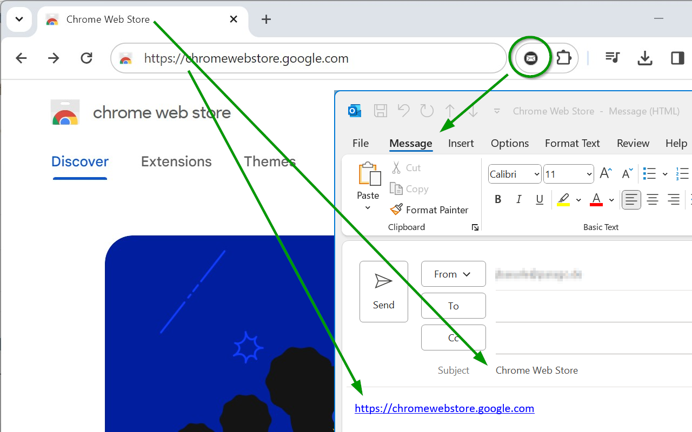

# SendURLByEmail
This Google Chrome extension adds a button to the toolbar which allows you to send the webpage URL via mail, using the default email client application (e.g. Outlook).

You will find the extension in the [Google Chrome Web Store](https://chrome.google.com/webstore/detail/send-url-by-email/mekllbldjjejnkmomdclgkomcnlbddfj) and now also on the [Microsoft Edge-Add-Ons](https://microsoftedge.microsoft.com/addons/detail/kncmeaikagaadnmlkglpfddfffmkoijj) site.

