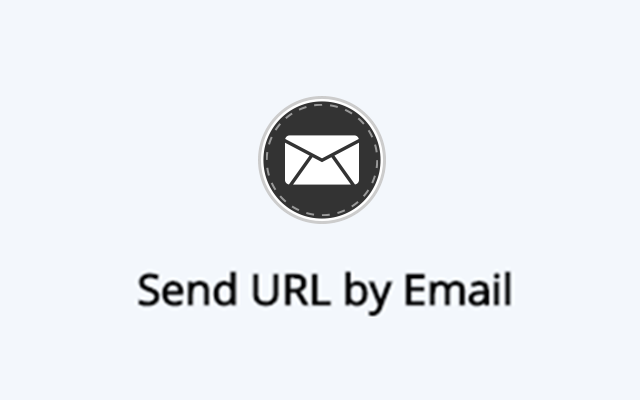

# SendURLByEmail
This Google Chrome extension adds a button to the toolbar which allows you to send the webpage URL via mail, using the default email client application (e.g. Outlook).

You will find the extension at [Google Chrome Web Store](http://github.com)https://chrome.google.com/webstore/detail/send-url-by-email/mekllbldjjejnkmomdclgkomcnlbddfj).

